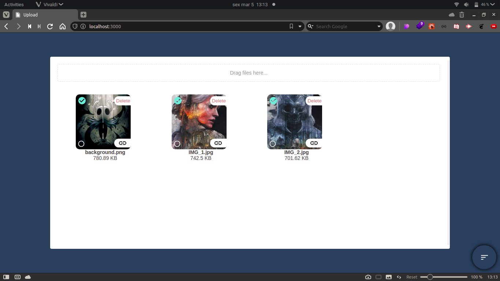
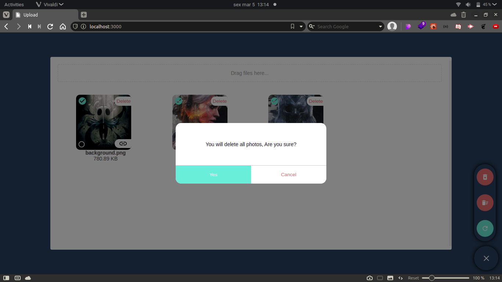
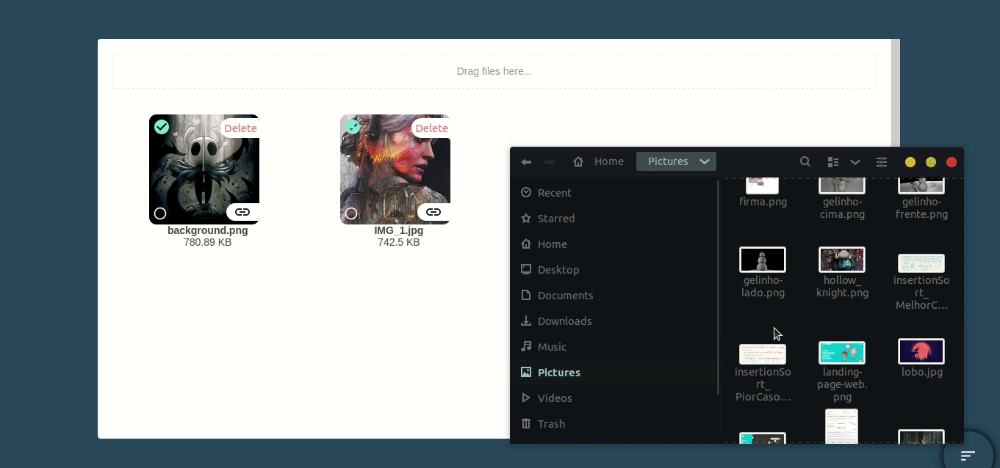
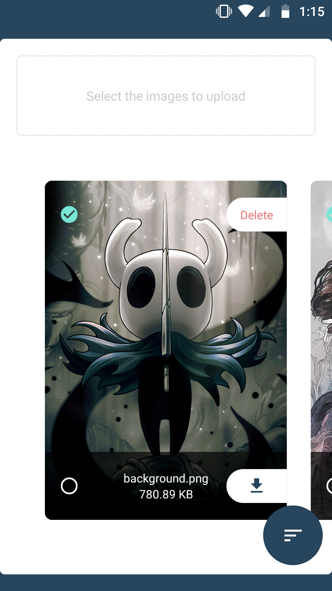
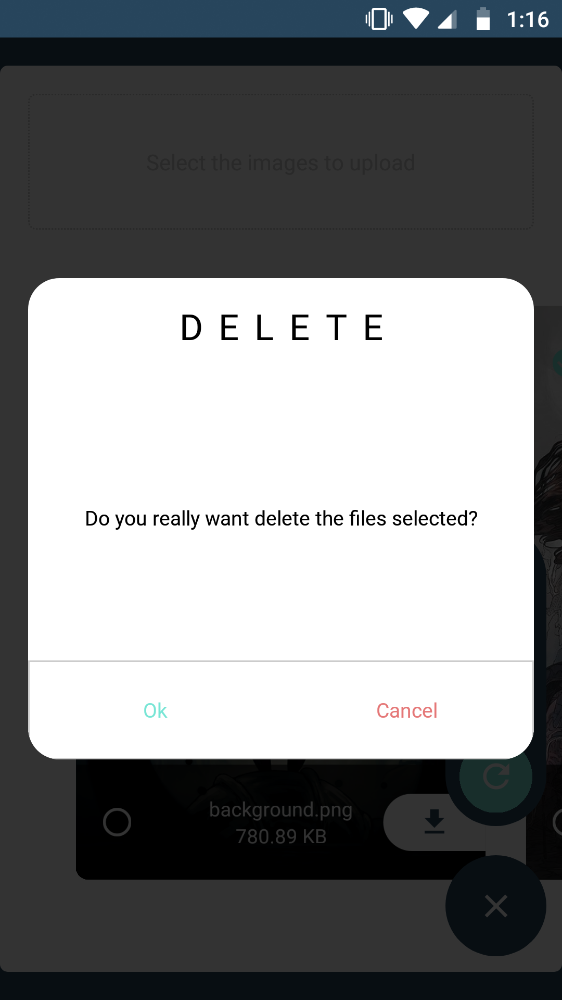

## Instalation

To run this project is necessary the Node.js LTS version, a mongodb database and the expo-cli.

- Open the terminal and run one of this commands:

```
yarn install-all
```
or
```
npm run install-all
```
<br/>

## Running the server

- To run the node server enter in upload-server folder and run the command bellow:

```
yarn dev
```
or
```
npm run dev
```

<br/>

## Running the web app

- To run the web app enter in the upload-web server and run the next command (remember execute the server before):

```
yarn dev
```
or
```
npm run dev
```

After open your browser in http://localhost:3000

Web Screen             |  Delete all photos
:-------------------------:|:-------------------------:
  |  

Demonstration |
:-------------------------:|
  |

<br/>

## Running the mobile app

- To run the mobile app connect your phone (Android/IOS) or launch a emulator, after open the folder nominated upload-mobile and run (remember execute the server before):

```
yarn start
```
or
```
npm start
```

Mobile Screen             |  Delete photo mobile           
:-------------------------:|:-------------------------:
  |   

### 🚀 Technologies used:
- TypeScript;
- NextJS;
- NodeJS;
- React Native;
- Expo;